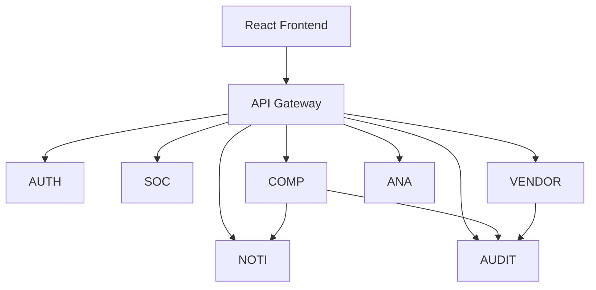
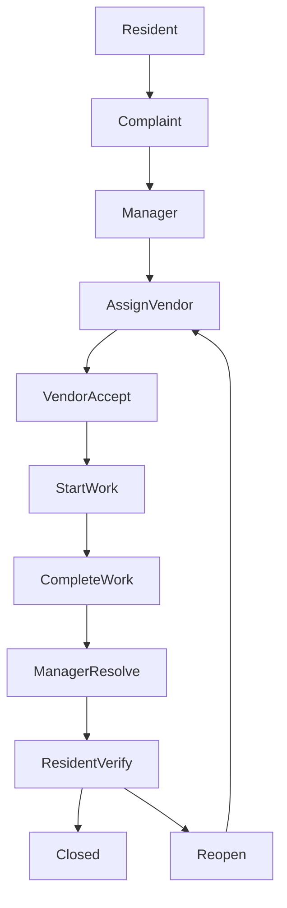

#  Smart Society SaaS Platform

> A production-style **Smart Society Management Platform** built using
> **Java Spring Boot Microservices**, **React + Vite**, **PostgreSQL**,
> and **Spring Cloud**.

 


##  Overview

A microservices-based society management platform where residents create
complaints, managers assign vendors, vendors complete work, residents
verify resolution, and audit/analytics/notifications operate across
services.

##  Features

-   JWT Authentication
-   Role-Based Access Control
-   API Gateway
-   Complaint Management
-   Vendor Management
-   Resident Verification
-   Complaint Timeline
-   Complaint Reopen
-   Audit Logging
-   Analytics Dashboard
-   WebSocket Notifications

##  Tech Stack

  Layer           Technology
  --------------- ---------------------------------------
  Backend         Java 21, Spring Boot
  Frontend        React, Vite, TypeScript, Tailwind CSS
  Database        PostgreSQL
  Security        Spring Security, JWT
  Communication   Spring Cloud OpenFeign
  Gateway         Spring Cloud Gateway
  Migration       Flyway

##  Services

  Service          Port
  -------------- ------
  API Gateway      8080
  Auth             8081
  Society          8082
  Complaint        8084
  Vendor           8085
  Notification     8086
  Analytics        8087
  Audit            8088

##  Architecture



##  Workflow



##  Application Screenshots

###  Authentication

| Login | Register |
|--------|----------|
|  |  |

---

###  Society Manager Dashboard


**Features**
- Manage complaints
- Assign vendors
- Mark complaints as resolved
- View analytics
- Audit logs
- Notifications

---

###  Resident Portal


**Features**
- Register complaints
- Track complaint status
- Verify completed work
- Reopen complaints if issue persists

---

###  Vendor Dashboard


**Features**
- View assigned complaints
- Accept work
- Start repair
- Complete work

---

###  Complaint Details


Shows the complete complaint lifecycle with timeline and current status.

---

###  Vendor Complaint Workflow


Vendor can:

- Accept Complaint
- Start Work
- Complete Work

---

###  Complaint Reopened Flow


Demonstrates the complete reopened complaint workflow:

- Resident rejects resolution
- Complaint reopens automatically
- Manager reassigns vendor
- Vendor completes work again
- Resident verifies successfully

##  Structure

``` text
api-gateway/
auth-service/
society-service/
complaint-service/
vendor-service/
notification-service/
analytics-service/
audit-service/
frontend/
```

##  Run

``` bash
mvn clean install
mvn spring-boot:run
```

Frontend:

``` bash
cd frontend
npm install
npm run dev
```

##  Environment Variables

``` text
POSTGRES_USERNAME=postgres
DB_PASSWORD=********
JWT_SECRET=********
```

##  Testing

-   API Testing
-   UI Testing
-   Complaint Lifecycle
-   Vendor Workflow
-   Resident Verification
-   Complaint Reopen
-   Audit Logging
-   Notifications

##  Future Enhancements

-   Docker
-   Kubernetes
-   AWS
-   CI/CD
-   Email/SMS
-   Mobile App
-   AI Complaint Prioritization

##  Author

**Ashish More**
