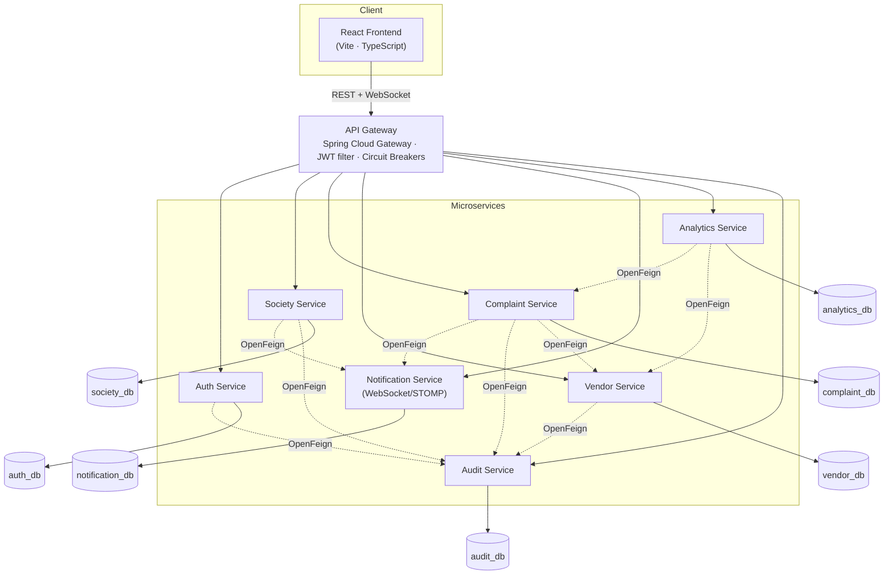
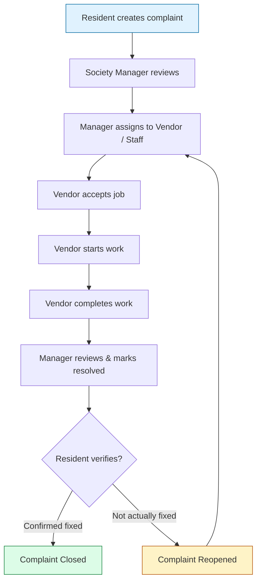
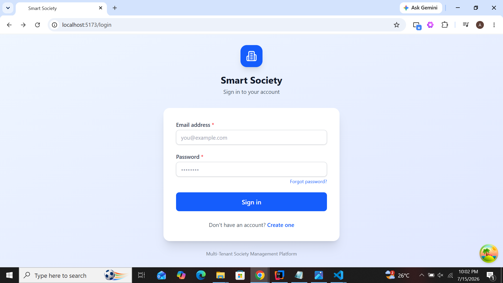
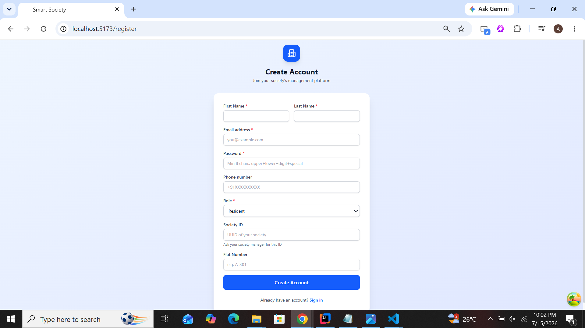
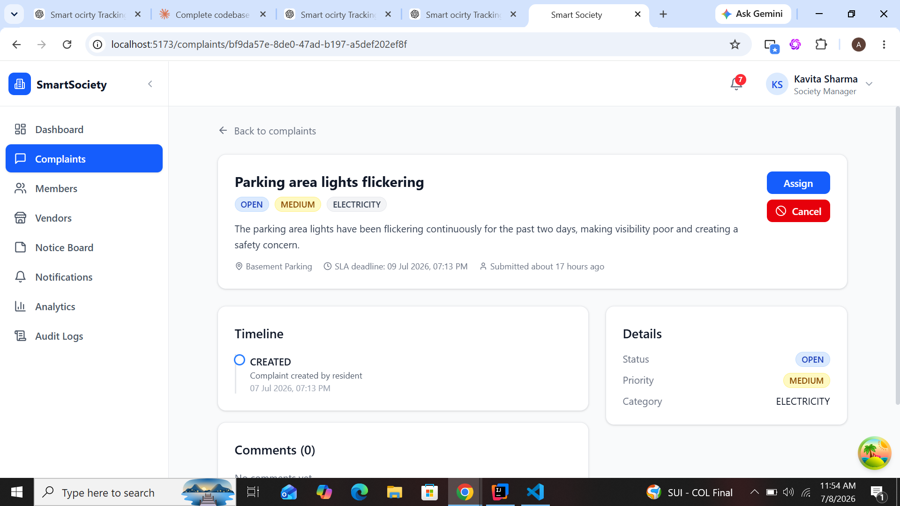
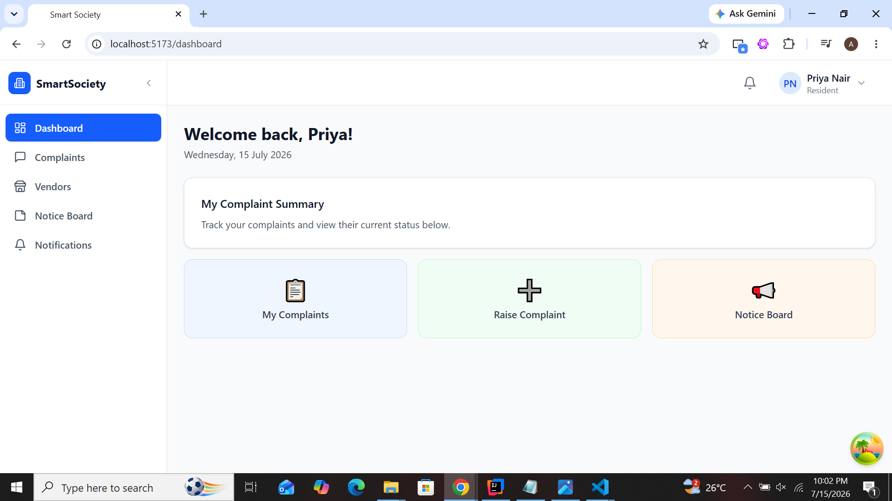
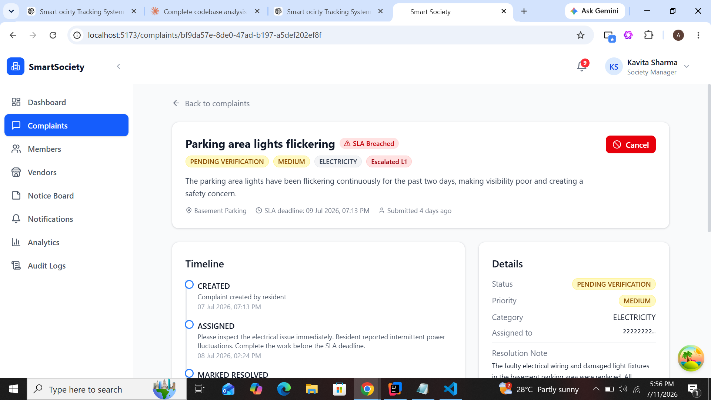
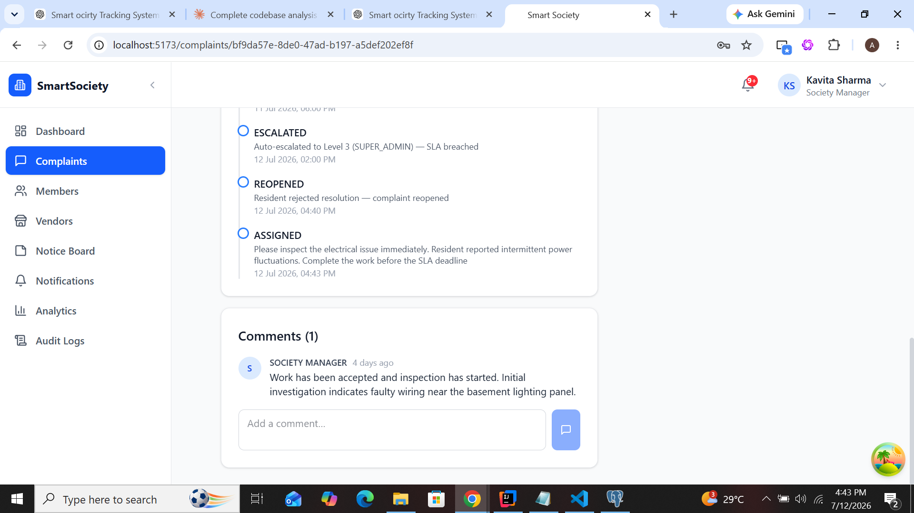

<div align="center">

#  Smart Society SaaS Platform

**A multi-tenant, microservices-based society & complaint management platform**
built with Spring Boot, Spring Cloud, React, and PostgreSQL.

[](https://openjdk.org/)
[](https://spring.io/projects/spring-boot)
[](https://spring.io/projects/spring-cloud)
[](https://react.dev/)
[](https://www.typescriptlang.org/)
[](https://www.postgresql.org/)
[](https://vitejs.dev/)
[](LICENSE)

</div>

---

##  About The Project

**Smart Society** is a multi-tenant SaaS platform for managing residential societies/apartment
complexes — built around a real, common pain point: complaints raised by residents (a leaking
pipe, a broken lift, a security issue) get lost in WhatsApp groups and notice boards, with no
visibility into who's handling them, no accountability for vendors, and no audit trail.

The platform models the **complete lifecycle of a complaint** — from a resident raising it, to a
manager assigning it to a vendor or maintenance staff, to the vendor working through it, to the
manager and finally the resident verifying the fix — across a **role-based, multi-tenant**
system that keeps every society's data isolated while sharing the same infrastructure.

It was built as an exercise in designing and shipping a **realistic microservices architecture**
end-to-end: service decomposition, inter-service communication, gateway routing, JWT auth
propagated across services, real-time notifications, and a production-style React frontend —
not just a CRUD demo.

---

##  Features

-  **JWT Authentication** — access + refresh token flow, password reset, change password
-  **Role-Based Access Control** — `SUPER_ADMIN`, `SOCIETY_MANAGER`, `COMMITTEE_MEMBER`, `RESIDENT`, `MAINTENANCE_STAFF`, `VENDOR`
-  **API Gateway** — Spring Cloud Gateway with JWT validation, request routing, and circuit breakers
-  **Spring Cloud OpenFeign** — typed, declarative inter-service communication
-  **Complaint Management** — full lifecycle: create → assign → accept → start → complete → resolve → verify → reopen
-  **Vendor Management** — vendor onboarding/approval, job assignment, ratings, performance tracking
-  **Society Management** — multi-society support, members, notices
-  **Resident Management** — society membership, flat/unit assignment
-  **Complaint Timeline** — full audit trail of every status change on a complaint
-  **Audit Logging** — append-only log of key actions across services
-  **Analytics Dashboard** — complaint trends, vendor performance, resolution metrics
-  **Real-Time Notifications** — WebSocket/STOMP over SockJS, personal + society-wide broadcasts
-  **PostgreSQL** — database-per-service
-  **Flyway Migrations** — versioned schema management per service
-  **React + Vite Frontend** — TypeScript, Redux Toolkit, TanStack Query
-  **Responsive UI** — Tailwind CSS
-  **REST APIs** — documented per-service with OpenAPI/Swagger

---

##  Tech Stack

| Category | Technologies |
|---|---|
| **Backend** | Java 21 · Spring Boot 3.4.7 · Spring Cloud Gateway · Spring Cloud OpenFeign 4.2.1 · Spring Data JPA (Hibernate 6) · Spring Security · Resilience4j |
| **Frontend** | React 19 · TypeScript 5.8 · Vite 6 · Redux Toolkit · TanStack Query v5 · React Router v7 · React Hook Form + Zod · Tailwind CSS 4 · Axios |
| **Database** | PostgreSQL 17 (database-per-microservice) |
| **Security** | JWT (jjwt) · BCrypt password hashing · Role-Based Access Control |
| **Messaging / Realtime** | STOMP over WebSocket, SockJS fallback |
| **Build Tools** | Maven (backend) · npm + Vite (frontend) |
| **Libraries** | Lombok · MapStruct · Recharts · date-fns · react-hot-toast |
| **Documentation** | springdoc-openapi (Swagger UI) per service |
| **Cloud / Infra** | Local development today; containerization & cloud deployment on the roadmap — see [Future Improvements](#-future-improvements) |

---

##  System Architecture

The platform is composed of a React SPA talking to a single API Gateway, which routes to eight
independent Spring Boot services — each owning its own PostgreSQL database. Services never talk
to each other's databases directly; cross-service reads/writes go through **Spring Cloud
OpenFeign** clients.



**How inter-service communication works:** each service exposes a typed `@FeignClient` interface
for the endpoints other services need (e.g. `NotificationClient`, `AuditClient`, `VendorClient`).
The gateway validates the JWT once and forwards the caller's identity downstream via
`X-User-Id` / `X-User-Role` / `X-Society-Id` headers, so a Feign call from, say,
`complaint-service` to `vendor-service` carries the same identity the original request had.
Feign clients declare a `fallback` class so a slow or unavailable downstream service degrades
gracefully (e.g. a notification failing to send never blocks a complaint assignment from
succeeding).

---

##  Complaint Workflow



Every transition in this flow writes an entry to the complaint's **timeline** (visible to all
parties) and triggers a **real-time notification** to the relevant party — the resident is
notified when their complaint is assigned, the vendor is notified of a new job, and the resident
is notified again once it's marked resolved and awaiting their verification.

---


##  Application Screenshots

###  Authentication

| Login | Register |
|--------|----------|
|  |  |

---

###  Society Manager Dashboard



**Features**
- Manage complaints
- Assign vendors
- Mark complaints as resolved
- View analytics
- Audit logs
- Notifications

---

###  Resident Portal



**Features**
- Register complaints
- Track complaint status
- Verify completed work
- Reopen complaints if issue persists

---

###  Vendor Dashboard


**Features**
- View assigned complaints
- Accept work
- Start repair
- Complete work

---

###  Complaint Details



Shows the complete complaint lifecycle with timeline and current status.

---

###  Vendor Complaint Workflow


Vendor can:

- Accept Complaint
- Start Work
- Complete Work

---

###  Complaint Reopened Flow



| # | Screenshot | Page | Login as | What should be visible | Why it matters |
|---|---|---|---|---|---|
| 1 | **Login** | `/login` | *(logged out)* | Login form, branding, no console errors | First impression — proves the app loads cleanly |
| 2 | **Manager Dashboard** | `/dashboard` | Society Manager | Complaint counts by status, recent activity | Shows the manager's operational overview |
| 3 | **Complaint List** | `/complaints` | Society Manager | Paginated list with status/priority badges, filters | Demonstrates list/filter/pagination UI |
| 4 | **Complaint Details** | `/complaints/:id` | Society Manager | Full complaint info, assigned vendor, current status | Core detail view of the whole system |
| 5 | **Assign Vendor** | `/complaints/:id` (assign modal open) | Society Manager | Vendor/staff dropdown, note field | Shows the assignment action that drives the workflow |
| 6 | **Vendor Dashboard** | `/dashboard` | Vendor | Vendor's own active/completed job counts | Shows the vendor-specific view of the same data |
| 7 | **Vendor Job Details** | `/complaints/:id` | Vendor | Accept / Start Work / Complete Work buttons, job info | Demonstrates the vendor side of the lifecycle |
| 8 | **Resident Dashboard** | `/dashboard` | Resident | Resident's own complaints, notices | Shows the resident-facing view |
| 9 | **Complaint Timeline** | `/complaints/:id` (timeline panel) | Any role | Full chronological history: created → assigned → accepted → resolved | Proves full auditability of the workflow |
| 10 | **Analytics Dashboard** | `/analytics` | Society Manager | Complaint trend chart, vendor performance chart | Showcases the analytics/reporting capability |
| 11 | **Audit Logs** | `/audit` | Society Manager | List of logged actions with actor, timestamp, action type | Demonstrates compliance/traceability features |
| 12 | **Notifications** | Notification dropdown (any page) | Resident or Vendor | Unread badge, list of notifications, real-time delivery | Shows the WebSocket notification feature working live |
| 13 | **Complaint Verification** | `/complaints/:id` (verify action) | Resident | "Verify Resolution" / "Reject" buttons on a resolved complaint | Shows resident closing the loop on their own complaint |
| 14 | **Reopened Complaint** | `/complaints/:id` | Society Manager or Resident | Status badge showing `REOPENED`, reopen count, timeline entry | Demonstrates the reopen/reassign edge case working correctly |

**Tip for a portfolio README:** a short screen-recording (GIF) of Steps 3 → 4 → 5 → 7 → 9 → 13
strung together tells the whole complaint story in ~20 seconds and is often more compelling to a
reviewer than static screenshots.

---

##  Folder Structure

```
smart-society-saas-platform/
├── smart-society-backend/
│   ├── api-gateway/                  # Spring Cloud Gateway, JWT filter, routing, circuit breakers
│   ├── auth-service/                 # Registration, login, JWT issuance/refresh, password reset
│   ├── society-service/              # Societies, members, notices
│   ├── complaint-service/            # Complaint lifecycle, timeline, comments, escalation scheduler
│   ├── vendor-service/               # Vendor onboarding, jobs, ratings
│   ├── notification-service/         # REST + WebSocket/STOMP notifications
│   ├── analytics-service/            # Dashboards, trends, vendor performance
│   ├── audit-service/                # Append-only audit log
│   └── docker-compose.yml            # Local Postgres instances for each service
│
├── smart-society-frontend/
│   ├── src/
│   │   ├── api/                      # Axios instance + per-domain API modules
│   │   ├── components/               # Shared/layout components
│   │   ├── hooks/                    # useAuth, useWebSocket, useNotifications, ...
│   │   ├── lib/                      # Utilities
│   │   ├── pages/                    # Route-level pages (auth, complaints, vendors, ...)
│   │   ├── store/                    # Redux Toolkit slices
│   │   ├── types/                    # Shared TypeScript types
│   │   ├── App.tsx                   # Routes + role-based route guards
│   │   └── main.tsx                  # App entrypoint, QueryClient/Redux/Router providers
│   ├── index.html
│   ├── package.json
│   └── vite.config.ts
│
└── README.md
```

Each backend service under `<service>/src/main/java/com/smartsociety/<service>/` follows the
same internal layout: `controller/ · service/ · repository/ · entity/ · dto/ · mapper/ ·
client/ (Feign) · config/ · exception/`, with Flyway migrations in
`src/main/resources/db/migration/`.

---

##  Installation

### Prerequisites
- Java 21 (JDK)
- Node.js 20+
- PostgreSQL 17
- Maven 3.9+

### 1. Database
Create one database per service (adjust names/credentials to match your `application.yaml` /
environment variables):
```bash
createdb smart_society_auth_db
createdb smart_society_society_db
createdb smart_society_complaint_db
createdb smart_society_vendor_db
createdb smart_society_notification_db
createdb smart_society_analytics_db
createdb smart_society_audit_db
```
Flyway runs automatically on each service's startup — no manual migration step needed.

### 2. Backend
Each service is an independent Spring Boot app. Start them in this order (auth-service and
api-gateway first, then the rest — order matters less once everything is up, but the gateway
needs the services it routes to for a fully working flow):
```bash
cd smart-society-backend/auth-service        && mvn spring-boot:run
cd smart-society-backend/society-service     && mvn spring-boot:run
cd smart-society-backend/complaint-service   && mvn spring-boot:run
cd smart-society-backend/vendor-service      && mvn spring-boot:run
cd smart-society-backend/notification-service && mvn spring-boot:run
cd smart-society-backend/analytics-service   && mvn spring-boot:run
cd smart-society-backend/audit-service       && mvn spring-boot:run
cd smart-society-backend/api-gateway         && mvn spring-boot:run
```
(Run each in its own terminal/IDE run configuration.)

### 3. Frontend
```bash
cd smart-society-frontend
npm install
npm run dev
```
The app runs at **http://localhost:5173** and proxies `/api` and `/ws` to the gateway/notification
service in development (see `vite.config.ts`).

---

##  Environment Variables

None of the values below are real secrets — replace every placeholder before running.

**Per backend service** (`application.yaml` / environment overrides):
```env
# Database
SPRING_DATASOURCE_URL=jdbc:postgresql://localhost:5432/<service_db_name>
SPRING_DATASOURCE_USERNAME=<db_username>
SPRING_DATASOURCE_PASSWORD=<db_password>

# JWT (auth-service — must match across services that validate tokens)
JWT_SECRET=<a-long-random-secret-string>
JWT_ACCESS_TOKEN_EXPIRY=<e.g. 900000 (15 min, ms)>
JWT_REFRESH_TOKEN_EXPIRY=<e.g. 604800000 (7 days, ms)>

# Inter-service URLs (used by OpenFeign clients / gateway routes)
AUTH_SERVICE_URL=http://localhost:8081
SOCIETY_SERVICE_URL=http://localhost:8082
COMPLAINT_SERVICE_URL=http://localhost:8084
VENDOR_SERVICE_URL=http://localhost:8085
NOTIFICATION_SERVICE_URL=http://localhost:8086
ANALYTICS_SERVICE_URL=http://localhost:8087
AUDIT_SERVICE_URL=http://localhost:8088
```

**Frontend** (`.env`):
```env
VITE_API_URL=/api
```

---

##  API Services

| Service | Port | Purpose |
|---|---|---|
| **API Gateway** | `8080` | Single entry point — JWT validation, routing, circuit breakers |
| **Auth Service** | `8081` | Registration, login, JWT issuance/refresh, password reset, profile |
| **Society Service** | `8082` | Societies, society members, notices |
| **Complaint Service** | `8084` | Complaint CRUD + full lifecycle, timeline, comments |
| **Vendor Service** | `8085` | Vendor onboarding/approval, job records, ratings |
| **Notification Service** | `8086` | REST notification history + WebSocket/STOMP real-time push |
| **Analytics Service** | `8087` | Complaint/vendor analytics, dashboards |
| **Audit Service** | `8088` | Append-only audit log across the platform |
| **Frontend (Vite dev server)** | `5173` | React SPA |

Each service exposes Swagger UI at `http://localhost:<port>/swagger-ui.html` for direct API
exploration.

---

##  Testing

Testing was done across several layers rather than a single automated suite:

- **API Testing** — a full Postman collection covering every endpoint across all 8 services,
  arranged in execution order (auth → society → members → notices → complaints → vendors →
  notifications → analytics → audit), including negative/validation test cases.
- **End-to-End UI Testing** — a written step-by-step QA test plan exercising the app exactly as a
  user would, from login through every module (auth, society, complaints, vendors, notices,
  notifications, analytics, audit).
- **Role-Based Workflow Testing** — every role (`SUPER_ADMIN`, `SOCIETY_MANAGER`,
  `COMMITTEE_MEMBER`, `RESIDENT`, `MAINTENANCE_STAFF`, `VENDOR`) verified against its intended
  route access and permissions.
- **Complaint Lifecycle Testing** — the full state machine exercised end-to-end: create → assign
  → accept → start work → complete work → resolve → verify.
- **Vendor Workflow** — vendor approval, job assignment, accept/start/complete, rating.
- **Resident Verification** — confirming a resolution both accepts (closes) and rejects (reopens)
  correctly.
- **Complaint Reopening** — verified the reopen counter increments and the complaint re-enters
  the assignment flow correctly.
- **Audit Logging Verification** — confirmed key actions (login, assignment, resolution, vendor
  approval, etc.) produce corresponding audit log entries.

A set of realistic, interconnected seed data (multiple societies, users across every role,
complaints in every status, vendors, notices, and notifications) was used throughout to make
every screen show meaningful data rather than an empty state.

---

##  Future Improvements

-  **Docker** — containerize each service + frontend with a `docker-compose` for one-command local spin-up
-  **Kubernetes** — Helm charts for orchestrated deployment
-  **AWS Deployment** — ECS/EKS + RDS for a real hosted environment
-  **Email Notifications** — complement in-app/WebSocket notifications with email
-  **SMS Notifications** — critical alerts (security, emergencies) via SMS
-  **Mobile Application** — React Native or Flutter companion app
-  **AI Complaint Prioritization** — ML-based triage of incoming complaints by urgency/category
-  **Monitoring** — Prometheus + Grafana for metrics, centralized logging (ELK)
-  **CI/CD** — GitHub Actions pipeline for build, test, and deploy on every push
-  **Service Discovery** — Eureka/Consul to replace static service URLs
-  **Caching Layer** — Redis for hot-path reads (dashboards, vendor lists)
-  **Event-Driven Messaging** — Kafka for async inter-service events, decoupling notification/audit writes from the request path

---

##  Author

**Ashish More**

- GitHub: [moreashish23](https://github.com/moreashish23)
- LinkedIn: [Ashish More](https://www.linkedin.com/in/ashish-more-0651932a6/)
- Email: moreashishshivaji23@gmail.com
- Portfolio: [ashish-portfolio.com](https://ashish-more-portfolio.vercel.app)

---

<div align="center">

 If you found this project interesting, consider giving it a star!

</div>
